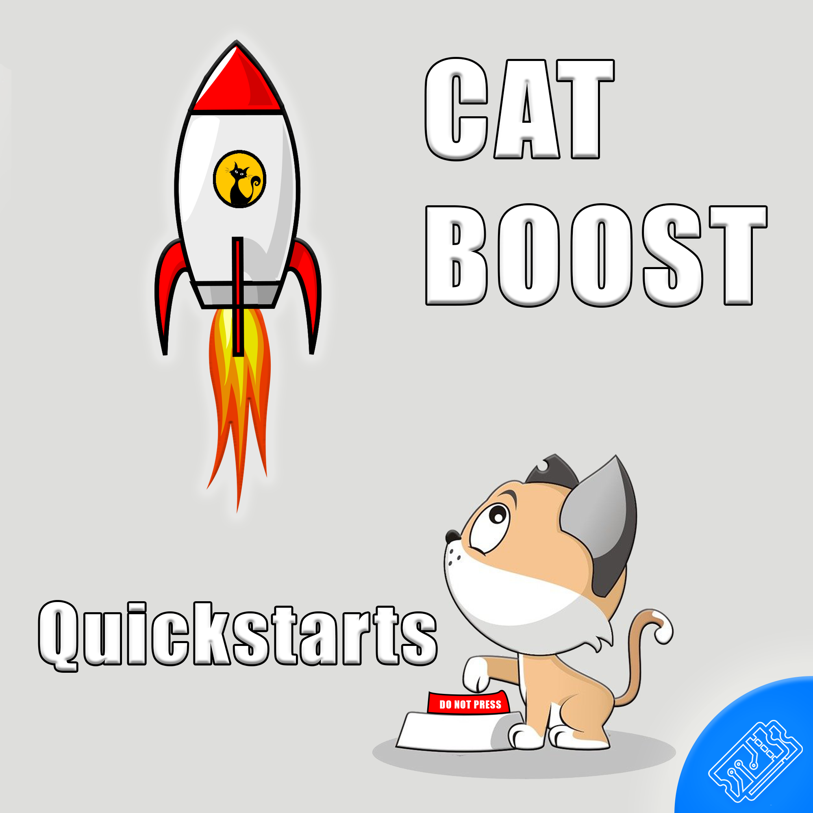

# T3chFlicks - CatBoost QuickStart

> This repo holds a collection of tutorial notebooks

## What?
CatBoost is a Machine Learning algorithm based on gradient boosted decision trees. In this repo you will find a series of notebooks that make use of the algorithm and helpful features of the CatBoost Python library.

## Contents
* Is it the thing? or is it not the thing? - `/binary_classifier.ipynb`
* What thing is it? - `/multinomial_classifier.ipynb`
* How to deal with things as input `/categorical_features.ipynb`

---